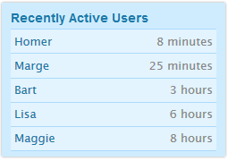
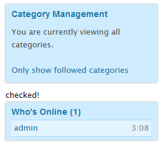
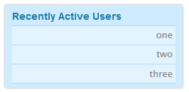

# How to build a simple module and integrate it as a plugin

I'd recommend you read the articles from the wiki about [modules](http://vanillawiki.homebrewforums.net/index.php/Modules) and [plugins](http://vanillawiki.homebrewforums.net/index.php/Writing_Plugins_for_Vanilla) before you read this guide.

We're going to build a simple module in this tutorial, showing us the most recent active users. We'll give it the name "Recently Active". We want to show who was last active and when this activity has been. This will be what we end up with:

If you look at the dashboard, you see "Plugins" and "Applications" in the Addons section. There is no place for modules and that gives you a good hint that you either have to hack the source code for showing a new module (ugly as hell) or you have to write a plugin. An application is no adequate solution for such a small problem. 

Okay, so first thing we've learned is that 

### Creating a module is one thing, but making it accessible needs a plugin

We will now do the following steps in order to create our "Recently Active" plugin:

* create the folder structure
* create the files
* learn what they do

Let's start. I want you to create two folders:
/your/path/to/vanilla/plugins/*RecentlyActive*
/your/path/to/vanilla/plugins/*RecentlyActive*/modules

And two files:
/your/path/to/vanilla/plugins/*RecentlyActive*/class.*recentlyactive*.plugin.php
/your/path/to/vanilla/plugins/*RecentlyActive*/modules/class.*recentlyactive*module.php

See how the name of our plugin is reflected in the file structure? Hope you've read the naming conventions for [plugins](http://vanillawiki.homebrewforums.net/index.php/Writing_Plugins_for_Vanilla) and [modules](http://vanillawiki.homebrewforums.net/index.php/Modules).

Now just copy and paste the following code into "class.recentlyactive.plugin.php" and do not think about what you are seeing here because we will talk about it in detail later on. 

<code>
<?php if (!defined('APPLICATION')) exit();
$PluginInfo['RecentlyActive'] = array(
   'Name' => 'RecentlyActive',
   'Description' => "Shows the most recently active users in the panel",
   'Version' => '1.0',
   'Requires' => FALSE, 
   'HasLocale' => FALSE,
   'Author' => "Robin",
   'RegisterPermissions' => FALSE,
   'SettingsPermission' => FALSE
);

class RecentlyActivePlugin extends Gdn_Plugin {
  
  public function Base_Render_Before($Sender) {
    // only add the module if we are in the panel asset and NOT in the dashboard
    if(GetValue('Panel',$Sender->Assets) && $Sender->MasterView != 'admin') {
      $RecentlyActiveModule = new RecentlyActiveModule($Sender);
      $Sender->AddModule($RecentlyActiveModule);
    }
  }
}
</code>

In your dashboard you now see our plugin (look for "Recently Active") and you can activate it. It is already finished and does what it should do: it displays the contents of "class.recentlyactivemodule.php" in the panel. You will not see any results because our module right now is only an empty text file. Open the module file with a text editor and write something in there. I've chosen the simple text "checked!" Save it and go to your home screen. Your panel should look like this:

YES! Now we can start to code. Do not forget to clear the file before you start, otherwise the "checked!" will break your neck ;-)

### No php file must be executable outside the framework!

So you have to ensure that whenever your php file is called *directly*, it has to exit. The first line in all of your code files should be this one:

<code>
<?php if (!defined('APPLICATION')) exit();
</code>

The garden framework has implemented useful routines for modules, plugins and controllers, so in order to use them your classes should derive the main classes from the framework.

### For a module your class must be derived from "Gdn_Module"

<code>
class RecentlyActiveModule extends Gdn_Module {
</code>

And look at how I named our class: I've CamelCased our plugin name and added the string "Module". That's the naming convention you've [already read](http://vanillawiki.homebrewforums.net/index.php/Modules) about.

The next one is easy and straight forward. We want the module to be in the panel and so we have to put this lines in our code

<code>
public function AssetTarget() {
  return 'Panel';
}
</code>

I hope you have taken a look in the wiki and you have already noticed that we need to have two functions in our own module: AssetTarget and ToString.

### AssetTarget shows where your module should be displayed and ToString gives back the content of your module

While the function above does not leave much to say, we can do a lot more in the next function. That's where our logic will reside.

<code>
public function ToString() {
  $limit = 7;
  $UserModel = new UserModel();
  $RecentlyActiveUsers = $UserModel->GetActiveUsers($limit)->Result();
</code>

$limit is the maximum number of recently active users. If your board has only five users, it will only show five users, but if it has more it will show at max $limit. You can set it to whatever you like
Afterwards we instantiate the class UserModel. Look at "applications/dashboard/models/class.usermodel.php" in order see what info you can get from this object.
And if you look in this class for "GetActiveUsers", you'll find this code:
<code>
public function GetActiveUsers($Limit = 5) {
      $this->UserQuery();
      $this->FireEvent('BeforeGetActiveUsers');
      return $this->SQL
         ->Where('u.Deleted', 0)
         ->OrderBy('u.DateLastActive', 'desc')
         ->Limit($Limit, 0)
         ->Get();
   }
</code>

You do not need to be a SQL crack to understand "OrderBy('DateLastActive', 'desc')". 'desc' means descending so we get the list of users in the order that we need them. Great! "$UserModel->GetActiveUsers($limit)" starts a database query and "->Result()" converts it into an array. For performance reasons, we should not start a db query each time we need this array, so we store the result in our array $RecentlyActiveUsers.

And now we can start our markup for the panel info. Just look at the HTML of the existing modules and copy it, only changing the css classes and ID for special markup.

<code>
echo '
';
echo '<h4>'.T('Recently Active Users').'</h4>';
echo '<ul class="PanelInfo PanelRecentlyActive">';
</code>

But wait, there is one more garden function in there, but it is really, really simple.

**"T('Something');" is for translating the user interface**

If you change the language of your board, garden will look in your current locale language file for the given string and echos the translation it finds. If there is no translation, it takes the given string.
T('Example') will echo "Example" if there is no string in your locale.php. But if it finds "$Definition['Example'] = 'Beispiel';" it will echo "Beispiel".

Do you want to see where we are right now? Add following code to our module, save and reload it:

<code>
// example start
    echo '<li>one</li>';
    echo '<li>two</li>';
    echo '<li>three</li>';
    echo '</ul>
';
// example end
</code>

You should see this:

If we look at the html side of our module, it is really simple
### Our module is just a div with class "Box" and our userlist will look fine if we use the ul tag with class "PanelInfo" 

Delete our example lines and let's move over to some more developer action:

<code>
foreach ($RecentlyActiveUsers as $User) {
  if ($User->Email != "")
</code>

We now will iterate through all recently active users and show them in a list. There is a plugin which allows anonymous users and if you use it, you will also see the user Anonymous which is more annoying than helpful. Showing them do not make any sense and therefore we do not show users without a mail address.

<code>
{
  echo '<li><strong>'.UserAnchor($User, 'UserLink').'</strong>';
  echo Gdn_Format::Seconds($User->DateLastActive).'</li>';
}
</code>

The function "UserAnchor" is coded in library/core/functions.render.php "*Takes a user object, and writes out an achor of the user's name to the user's profile*". It can do more. It can add a class to the link "in this case, I've provided the class "UserLink" to every line. 

### UserAnchor($User, 'classname'); gets expanded to <a href="/profile/1/administrator" class="classname">administrator</a>

Next line shows the DateLastActive value "*in a human-readable way*". The function is provided by the Gdn_Format class, which you can find here: library/core/class.format.php. Going through this file, you'll find out that Gdn_Format provides several useful functions to convert nearly anything you need when working with Garden.
For example there are functions for converting markdown or bbcode to html, unicode to ascii and some very nifty array conversion functions.

### If you have to convert a string, take a look at Gdn_Format first if there's not already a function for that

Well, we are almost finished with our module and so I'll past here the complete code:

<code>
<?php if (!defined('APPLICATION')) exit();
  
class RecentlyActiveModule extends Gdn_Module {

  public function AssetTarget() {
    return 'Panel';
  }
  public function ToString() {
    $limit = 7;

    $UserModel = new UserModel();
    $RecentlyActiveUsers = $UserModel->GetActiveUsers($limit)->Result();
    echo '
';
    echo '<h4>'.T('Recently Active Users').'</h4>';
    echo '<ul class="PanelInfo PanelRecentlyActive">';

    foreach ($RecentlyActiveUsers as $User) {
      if ($User->Email != "") // invalid or anonymous users
      {
        echo '<li><strong>'.UserAnchor($User, 'UserLink',).'</strong>';
        echo Gdn_Format::Seconds($User->DateLastActive).'</li>';
      }
    }
    echo '</ul>
';
  }
}
</code>

That's it. You can use your new plugin now. But as I've mentioned above, there are some things that could be said about the plugin. Here it comes...

Open the "class.*recentlyactive*.plugin.php" and let's take a look at what we have done there. We begin with the PluginInfo array. You'll find the information for that in the [wiki](http://vanillawiki.homebrewforums.net/index.php/Writing_Plugins_for_Vanilla). Most of what you see here is trivial so we will not go through this part.

<code>
$PluginInfo['RecentlyActive'] = array(
   'Name' => 'Recently Active',
   'Description' => "Shows the most recently active users in the panel",
   'Version' => '1.0',
   'Requires' => FALSE, 
   'HasLocale' => FALSE,
   'Author' => "Robin",
   'RegisterPermissions' => FALSE,
   'SettingsPermission' => FALSE
);
</code>

The description is not too exact from developers point of view: our **plugin** will not show those users, but our **module** will and the plugin only adds it to the existing modules. But from the users point of view, the description in the array is better: enabling the plugin shows the module and thus the information.

### Every plugin must extend the Gdn_Plugin class

And we have to follow a naming convention again: it must be named like the CamelCased plugin name we've already used for the plugin info array plus the word "Plugin":

<code>
class RecentlyActivePlugin extends Gdn_Plugin {
</code>

Now we can hook an event in order to show our module. I must agree that *I can give you no advise* which event you have to hook. Look at other plugins or ask the community. Sorry for that.

You can read about hooks [here](http://vanillawiki.homebrewforums.net/index.php/Event_Hooks) but I'm sorry that we have to use a hook which doesn't follow the normal conventions. We'll use "Base_Render_Before", "*This method gets called before the Render method gets called on every single class that extends the Controller class (ie. every controller in every application).*". Normally hooks are named in the following way: Controller_Function_Action and so we'd expect to see a controller named "class.basecontroller.php". But because of the statement above we now,  the this Base_Render_Before comes directly from the main controller class of the framework.
Okay, that's at least one reason, why we have to derive not only plugins but also controllers from one given class! ;-)

The function is called with a parameter "$Sender". If I got it right,

### $Sender is the calling controller himself

This is really practical, because thus we can get every information from the original source we hooked.

<code>
public function Base_Render_Before($Sender) {
</code>

Everything line of code we write in this function will be executed before every single call to a controller. So we have to ensure that it will only be executed if we are "at the right place" in code execution.

<code>
if(GetValue('Panel',$Sender->Assets) && $Sender->MasterView != 'admin') {
</code>

"GetValue" is defined in library/core/functions.general.php: "*Return the value from an associative array or an object.*"
And here's the explanation for the "Assets" array (from  library/core/class.controller.php, the class every controller is derived from): "*An associative array that contains content to be inserted into the master view. All assets are placed in this array before being passed to the master view. If an asset's key is not called by the master view, that asset will not be rendered.*"

So if the calling controller has an asset called "Panel" we want to add our module. We could add it anywhere but it only makes sense in the panel.

If you look at your theme, you'll find the file "*default*.master.tpl" in the subfolder design. For the admin pages, the file "*admin*.master.tpl" gets loaded. So the MasterView for the dashboard will be "admin" and we do not want to see our module in the dashboard. Again some words from the base controllers source "*The name of the master view [...] Typically [...] is part of the master view's file name. ie. $this->MasterView.'.master.tpl'*"

Okay, only if the controller called our plugin from non admin pages and only if the calling controller renders the panel, we want to add our module. But first we have to instantiate our module.

<code>
$RecentlyActiveModule = new RecentlyActiveModule($Sender);
</code>

Looks like magic, but only because we haven't spoken about the directory structure in details. Garden as a smart framework relies on some conventions: modules should be in a subfolder called modules, views should be in a subfolder called views and so on. If you stick to this conventions, you will not need to define where you have saved your resources. And if you do not know where to put css or js files, just look in the structure of the dashboard or the vanilla application. We have used the right subfolder for our module and so we can instantiate the class we've in that file.

We only need one command for our plugin to work:
<code>
      $Sender->AddModule($RecentlyActiveModule);
</code>
$Sender called our plugin and $Sender has an asset called "Panel". So $Sender is obviously the place where we like to add something and we want to add our small module. And that's exactly what is done in this piece of code.

If you want to change the order of the displayed modules, you'll have to change the config file. This is not as easy as described in the wiki (and so I will not give you the link this time), because the order is defined in a serialized string. Search for online tools that help you serializing and unserializing arrays if you need to change the order. 

That's it. Enjoy exploring Gardens functionalities and if you've got ideas for useful sidepanel modules, just try to realize them!

